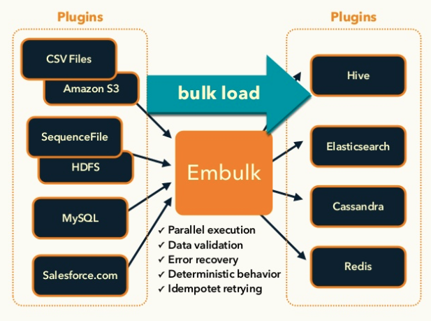
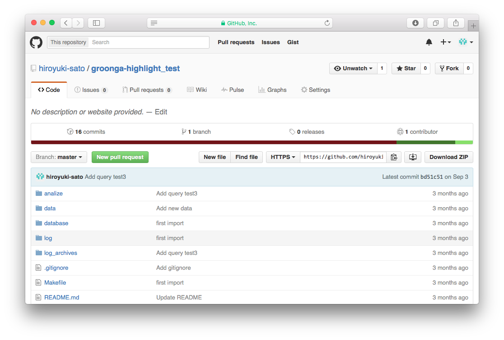

# Groonga\\n導入事例

author
:  佐藤 博之

content-source
:  Groonga Meatup 2015  

date
:  2015-11-29

theme
:   .

# 自己紹介

* 佐藤博之
  * Twitter: @hiroysato
  * GitHub: hiroyuki-sato
* 営業・インフラ担当

# 最近の営業活動

* OS
  * Linux, Windows, OSX
* Infiniband/RoCE
  * RDMA, iSER, SRP
* その他
  * VyOS、Asterisk、Sisimai、PostgreSQL

# 目次

* 構築したサービスの要件
* Groongaを選んだ理由
* システム構成
* Groongaへデータ登録方法
* 使ってみて

# 構築したサービスの要件

* 入力ソース
  * 電子メール
* 出力
  * 指定したキーワードの含まれる記事をピックアップ
  * PDF・Excelなどに整形

# 構築したサービスの要件

{: relative_height="100"}

# 全文検索ソフトウェア

**日本語全文検索**
-> Groonga

# なぜGroonga

* 単体で日本語対応してくれそう
  * 実際単体で全角英字や半角英字を正規化してくれた。
  * Groonga Ｇｒｏｏｏｎｇａ など
* 須藤さんがメンテナ
  * ActiveLDAP, rcairoなどの実績

# サーバ構成

* 全文検索システム: Groonga
* メールの定期取得
  * fetchmail/procmail
* データ登録: embulk
  * プラグインを自作
* データ出力: groonga-client

# 構成

{: relative_height="100"}

# embulk(エンバルク)

* オープンソースバルクローダ
* マルチプラットフォーム
  * OSX, Linux, Windows..
* プラグインアーキテクチャ
  * 約100個のプラグインが利用可能
  * 言語: Java(Scala)とJRuby

# embulkの構成

{: relative_height="100"}

{:note="出典：http://www.slideshare.net/frsyuki/embuk-making-data-integration-works-relaxed" }

# groongaプラグイン

* embulk-output-groonga
  * groongaデータロード用
* ライセンス
  * オープンソース
  * https://github.com/hiroyuki-sato/embulk-output-groonga

# プラグイン利用例

{: relative_height="100"}

# サンプルデータ

{: relative_height="80"}

# 設定例(入力部)

```
in:
  type: file
  path_prefix: hoge/csv/sample_
  decoders:
  - {type: gzip}
  parser:
    charset: UTF-8
    newline: CRLF
    type: csv
    columns:
    - {name: id, type: long}
    - {name: title, type: string}
    - {name: date, type: timestamp, format: '%Y/%m/%d'}
    - {name: comment, type: string}
```
{: lang="yaml"}

# 設定例(出力部)

```
out:
  type: groonga
  table: Data # 投入先のテーブル名
  host: localhost
  protocol: http
  key_column: title # キーにするカラム
```
{: lang="yaml"}

# Embulkの情報サイト

* Embulk
  * http://www.embulk.org
* Qiita: Fluentdのバッチ版Embulk(エンバルク)のまとめ
  * http://qiita.com/hiroysato/items/397f36c4838a0a93e352

# 導入結果

なんか遅い

# 疑似コード

```
select \
  --table Data \
  --match_columns article \
  --output_columns "_key,highlight_html(article),line_no" \
  --query "( Groonga OR ぐるんが ) OR (line_no:>1 + line_no:<500)" \
  --command_version 2 \
  --limit -1
```

Groongaなどのキーワードは40個ぐらい

# 遅い原因

{: relative_height="100"}

# 遅い原因

**highlight_html**がとても遅い

# highlight_html

* **ぐるんが**は全文検索エンジンです。
* ぐるなびさんでも活用されれている**Groonga**
* 毎年11月29日に開催される**Groonga**の会

# 不具合報告

**須藤さん**助けて

# 不具合報告

{: relative_height="100"}

# 改修結果(5.0.8~)

{: relative_height="100"}

# Thanks

**ありがとうございました。**
